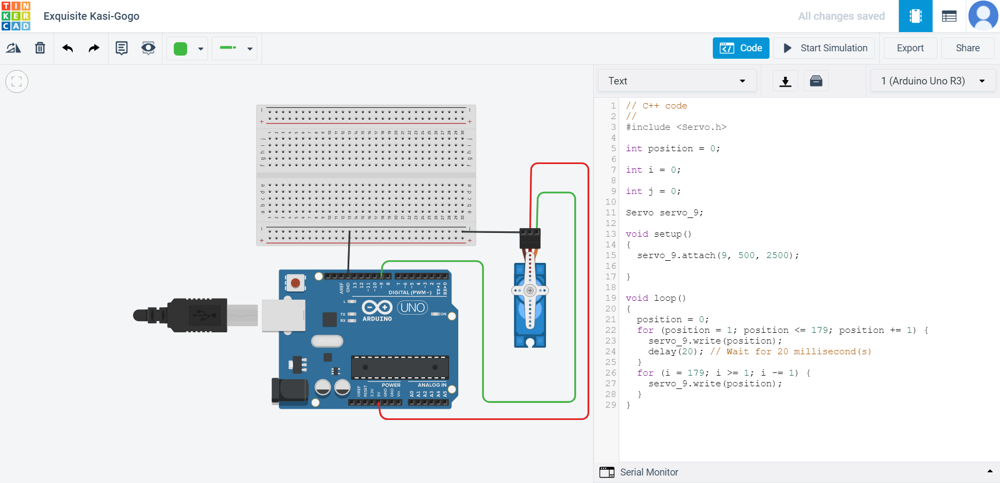

# ServoMotorArduino_Electrical
## Task 1 of the electrical and power engineering track of summer training at Smart-Methods


### [Click here to Start simulation via tinkercad](https://www.tinkercad.com/things/bc3J3yHT5mv-exquisite-kasi-gogo)

Code :

```
// C++ code
//
#include <Servo.h>

int position = 0;

int i = 0;

int j = 0;

Servo servo_9;

void setup()
{
  servo_9.attach(9, 500, 2500);

}

void loop()
{
  position = 0;
  for (position = 1; position <= 179; position += 1) {
    servo_9.write(position);
    delay(20); // Wait for 20 millisecond(s)
  }
  for (i = 179; i >= 1; i -= 1) {
    servo_9.write(position);
  }
}
```
</br>


</br>

</br>
